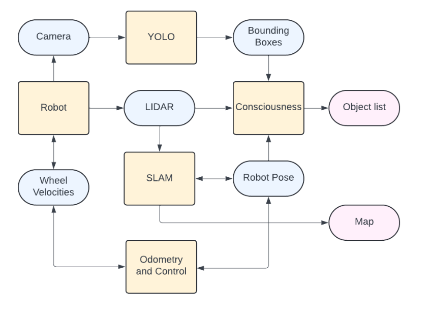

# Easy Object-Conscious SLAM

## Esteban Padilla Cerdio

---

## About the Project

## [Read the Paper](https://github.com/Esteb37/object-conscious-slam/blob/main/Report.pdf)

Simultaneous Localization and Mapping (SLAM) allows robots to understand where they currently are in relation to an environment, 
and at the same time create a map of their surroundings. Object-Conscious SLAM (OCSLAM) introduces an additional
layer of knowledge by allowing the robot to locate and classify objects within this world. I propose a simple method that
leverages LIDAR information already being used for regular SLAM, in combination with the You Only Look Once (YOLO)
network for locating, classifying and tracking objects.

## Demonstration Video 

## Presentation Video 

## System Architecture

